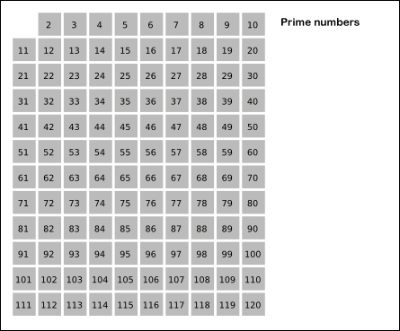

# Problem 10 - Summation of primes

## Description

The sum of the primes below 10 is 2 + 3 + 5 + 7 = 17.

Find the sum of all the primes below two million.

## Solutions

| Language               | Path (link)                            |
| :--------------------- | :------------------------------------- |
| Go eratosthenes method | [`regular.go`](./main.go)              |
| Go    regular method   | [`eratosthenes.go`](./eratosthenes.go) |
| Python (eratosthenes)  | [`main.py`](./main.py)                 |

The sieve of _Eratosthenes_ method (Ancient Greek: κόσκινον Ἐρατοσθένους, kóskinon Eratosthénous): is a simple, ancient algorithm for finding all prime numbers up to any given limit[^1].

  
Final result

  
  ### 31875000

[^1]: https://www.w3resource.com/python-exercises/list/python-data-type-list-exercise-34.php